# Flicker 🎬

<p align="center">
  
</p>

**The space between frames.** Cinema is twenty-four still pictures a second and the darkness between them that your eye never sees — the flicker is what makes the picture move. Your homelab is the same trick: the household sees the movie (Plex plays, requests appear, downloads land); underneath, a strip of machinery advances frame by frame. Flicker is the console for the person who threads the projector.

One terminal. Every machine. Live streams, request queues, freight, host health — with guarded operational actions and a mascot who takes his shift seriously.

A [Liminal HQ](../) project: pull-not-push, bounded, glance-first, explorable with zero setup.

## Quick start

```bash
cargo run -- --demo    # full fake homelab, zero config, zero network
cargo run -- --init    # scaffold $XDG_CONFIG_HOME/flicker/config.toml
cargo run -- --check   # poll every configured source once, print a report
cargo run              # the real thing
```

## The rooms

Screens are rooms; the config names them and decides what hangs in each. The default reel for a media-server lab:

| screen | what's in it |
|---|---|
| **NOW SHOWING** | who's watching what, right now — per-stream progress, transcode verdicts, a bandwidth sparkline |
| **COMING SOON** | Overseerr requests awaiting a thumbs-up, and the *arr queues fetching the future |
| **FREIGHT** | qBittorrent and NZBGet — the trucks |
| **BACK LOT** | the machines themselves: Glances gauges, disks, `docker ps` over ssh |
| **THE BOOTH** | Jax's office (optional, recommended) |

## First reel of plugins

`tautulli` · `sonarr` · `radarr` · `lidarr` · `prowlarr` · `qbittorrent` · `nzbget` · `overseerr` · `glances` · `ssh` · `jax`

Every source can carry **actions** — terminate a stream, approve a request, pause the queue, restart a container. Anything destructive is marked ⚠ and always routes through a curtain-red confirm modal that defaults to *no*.

## Keys

```
1-9        jump to screen            enter / a   actions for the selection
[ ] / h l  previous / next screen    : / p       command palette
tab        cycle panel focus         r / R       refresh one / everything
j k / ↑ ↓  move row selection        J           toggle Jax    q  quit
```

## Config

`$XDG_CONFIG_HOME/flicker/config.toml` (default `~/.config/flicker/config.toml`), permissions 0600 — it holds your API keys. `--init` writes a commented example; `--check` is your setup debugger.

```toml
refresh_secs = 15

[[screens]]
name = "NOW SHOWING"

  [[screens.sources]]
  kind = "tautulli"
  url = "http://192.168.1.10:8181"
  api_key = "…"

[[screens]]
name = "BACK LOT"

  [[screens.sources]]
  kind = "ssh"          # plain ssh, BatchMode — your ~/.ssh/config applies
  name = "nas"
  host = "192.168.1.20"
```

## Jax 2.0 🦦

The ambient mascot from [jira-tui](https://github.com/smorrisods/jira-tui) moved into the booth — and 2.0 gave him **moods**. He watches the same panels you do: streams playing and he's running the projector, reel spinning; downloads moving and he's hauling crates; a source erroring and he's at the splice bench sweating; an action lands and it's confetti. Quiet lab? Fishing.

He's also a plugin (`kind = "jax"`): his own panel, an animated scene, and a rolling shift log — *"rewound reel 3 by hand, character building."* You can pet him. You can toss him a snack. He's keeping count.

## Writing a plugin

The core knows nothing about Plex. It knows about `Source`:

```rust
#[async_trait]
pub trait Source: Send {
    async fn poll(&mut self) -> Result<Panel>;
    async fn execute(&mut self, action_id: &str, row_key: &str) -> Result<String>;
}
```

A `Panel` is plain data — badge, gauges, rows, sparkline, footer, actions — with semantic `Tone`s the theme maps to colour. Sources never import ratatui. To add one: a file in `src/plugin/`, an arm in `registry::build`, a demo panel in `demo.rs`. That's the whole ceremony. See [SPEC.md](SPEC.md) for the design and the liminal contract.

## Building

Rust 1.87+. `cargo build --release` → a single binary. Fully async (tokio); HTTP via reqwest; `ssh` sources shell out to your real ssh so keys, jump hosts, and `~/.ssh/config` just work.

```bash
cargo test                       # unit tests
cargo clippy -- -D warnings      # lints
cargo run -- --demo              # the standing UI fixture
```

## Licence

MIT © 2026 Liminal HQ, Scott Morris
